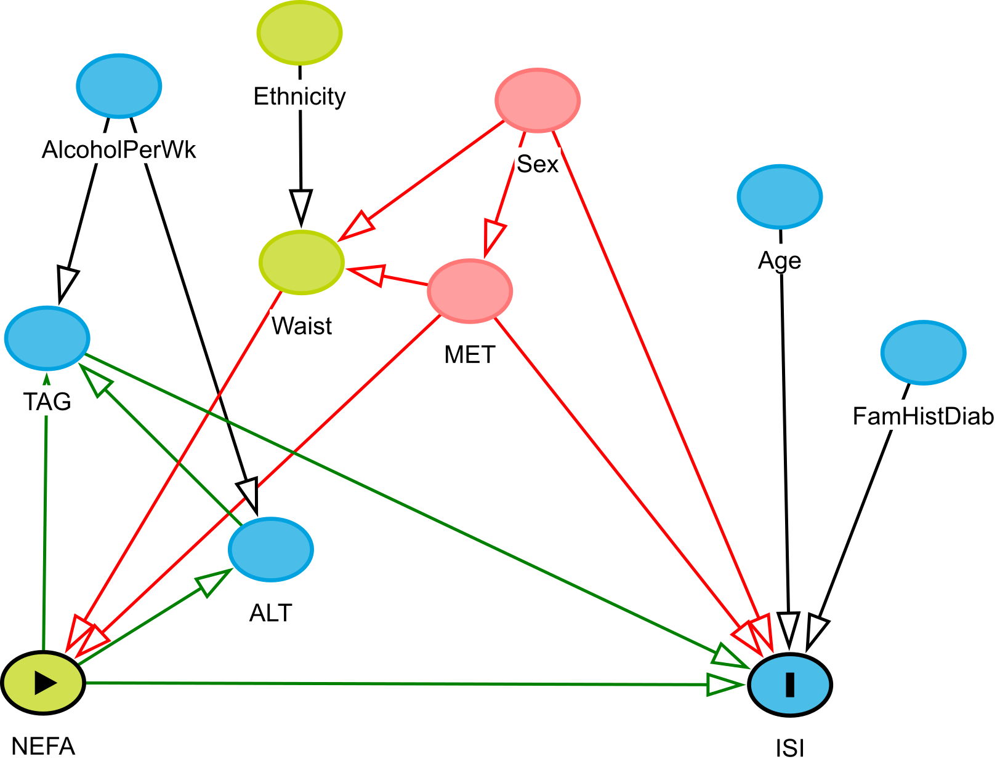
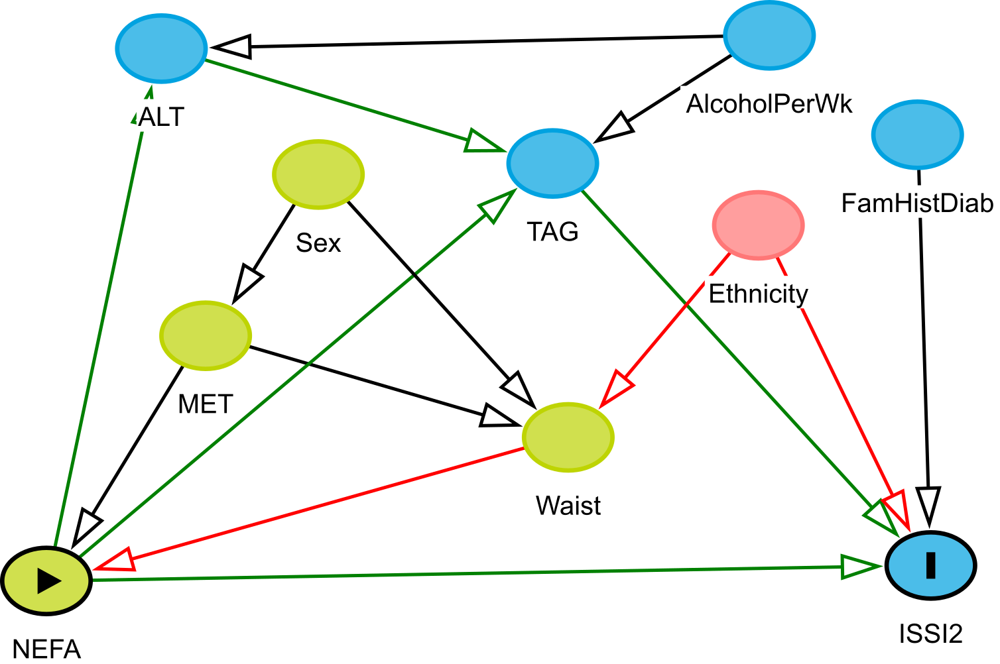

# ESM Figures

![ESM Fig.  6: Longitudinal associations of individual non-esterified fatty acids (mol% and nmol/mL) with insulin sensitivity and beta-cell function over the 6 years in the PROMISE cohort. Generalized estimating equation models were fully adjusted, *excluding waist circumference*. X-axis values represent a percent difference in the outcome per SD increase in the fatty acid. P-values were adjusted for the BH false discovery rate, with each increase in dot size and blackness representing a p-value significance of p>0.05, p<0.05, and p<0.01.](esm-figures_files/figure-docx/ESM_Fig6-1.png)

